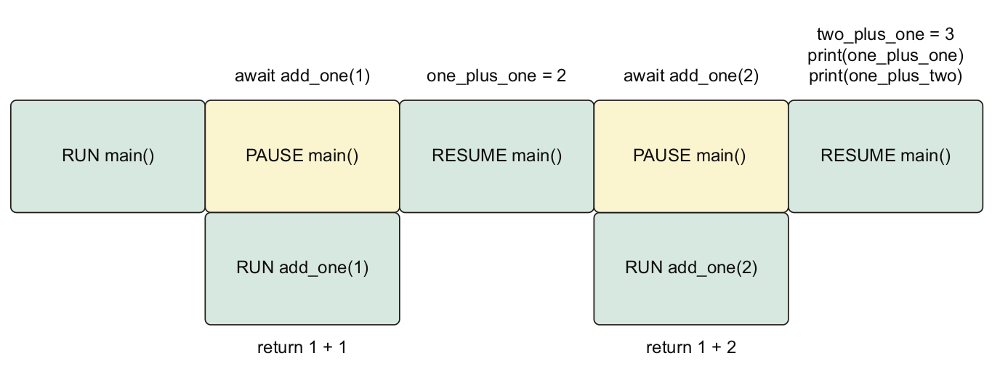
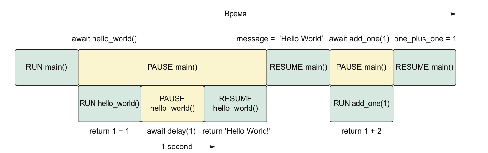

# Основы asyncio

## 2.1 Сопрограммы
Создаются сопрограммы при помощи ключевого слова **async**:

```python
async def my_coroutine() -> None:  
    print('Hello world!')
```

Но мы не можем просто так ее вызвать, как обычную функцию. Следующий код вернет вот такой результат:
```python
coroutine_result = my_coroutine()
print(coroutine_result)
```

```console
<coroutine object my_coroutine at 0x7fde6da418c0>
```

Чтобы выполнить сопрограмму, мы должны явно передать ее циклу событий.
Для этого мы должны либо создать его вручную, либо воспользоваться специальными функциями из *asyncio*. Одна из них [**asyncio.run()**](https://docs.python.org/3/library/asyncio-runner.html#asyncio.run).
```python
import asyncio  
async def my_coroutine() -> None:  
	print('Hello world!')  
  
result = asyncio.run(my_coroutine())  
print(result)
```

*asyncio.run()* выполняет следующие задачи:
* создает новое событие
* выполняет код переданной нами сопрограммы до конца и возвращает результат
* останавливает и закрывает цикл событий
* эта функция задумана как главная точка входа в созданное нами приложение asyncio

## Ключевое слово **await**
Использование ключевого слова **await** приводит к выполнению следующей за ним сопрограммы, а не просто к возврату объекту сопрограммы, как при  прямом вызове. Кроме того, выражение *await* приостанавливает объемлющую сопрограмму до того момента, как сопрограмма, которую мы ждем, завершится и вернет результат.
А после этого мы получим доступ к возвращенному результату, а объемлющая сопрограмма пробудится и обработает результат.

```python
import asyncio  
  
async def add_one(number: int) -> int:  
	return number + 1  
  
  
async def main() -> None:  
	# Здесь программа приостанавливается и ждет выполнения сопрограммы add_one(1)  
	one_plus_one = await add_one(1)  
  
	# Здесь программа приостанавливается и ждет выполнения сопрограммы add_one(2)  
	two_plus_one = await add_one(2)  
	print(one_plus_one)  
	print(two_plus_one)  

asyncio.run(main())
```

Поток выполнения изображен на рисунке ниже:

Этот код работает так же, как обычный последовательный код. По
существу, мы имитируем обычный стек вызовов.

## 2.2 Функция asyncio.sleep

Для имитации длительных операций (веб-запросы или запросы к базе данных) используется функция [asyncio.sleep()](https://docs.python.org/3/library/asyncio-task.html#asyncio.sleep).

```python
import asyncio  
  
async def hello_world_message() -> str:  
# asyncio.sleep() -- сопрограмма, поэтому вызываем при помощи await  
	await asyncio.sleep(1)  
	return 'Hello World!'  
  
async def main() -> None:  
	message = await hello_world_message()  
	print(message)  
  
asyncio.run(main())
```  


Для того, чтобы было очевидно, когда мы вызываем sleep и как при этом конкурентно работает другой код, мы организуем в папочке utils следующую функцию:

```python
async def delay(seconds: int) -> int:  
	print(f'sleep for {seconds} second(s)')  
	await asyncio.sleep(seconds)  
	print(f'finished sleeping for {seconds} second(s)')  
	return seconds
```

Сопрограмма delay принимает целое число – продолжительность сна в секундах и возвращает это же число вызывающей стороне по завершении сна. Мы также печатаем сообщения, когда сон начался и закончился. Это позволит увидеть, как конкурентно работает другой код, пока наша сопрограмма приостановлена. 

Давайте теперь рассмотрим следующий код:

```python
import asyncio  
from utils import delay  
  
async def add_one(number: int) -> int:  
	return number + 1  
  
async def hello_world_message() -> str:  
	await delay(1)  
	return 'Hello World!'  
  
async def main() -> None:  
	# Приостановить main до возврата  
	# из hello_world_message  
	message = await hello_world_message()  
	# Приостановить main  
	# до возврата из add_one  
	one_plus_one = await add_one(1)  
	print(one_plus_one)  
	print(message)  
  
asyncio.run(main())
```
При выполнении этого кода будет выведен следующий результат:

```console
sleep for 1 second(s)
finished sleeping for 1 second(s)
2
Hello World!
```

Здесь мы можем заметить, что прежде чем вывести результат функций `add_one` и `hello_world_message` пройдет одна секунда.

Здесь происходит следующее:
И `main`, и `hello_world` приостановлены в ожидании завершения `delay(1)`. А когда это случится, `main` возобновляется и может выполнить `add_one`.



А нам бы хотелось сделать так, чтобы `add_one(1)` было напечатано немедленно, пока `hello_world_message()` работает конкурентно.

Все дело в том, что вызов `await` приостанавливает текущую сопрограмму и код внутри нее не выполняется, пока выражение await не вернет значение.

