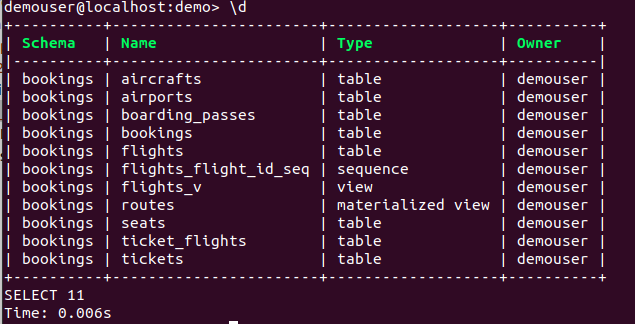
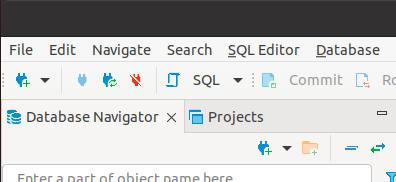
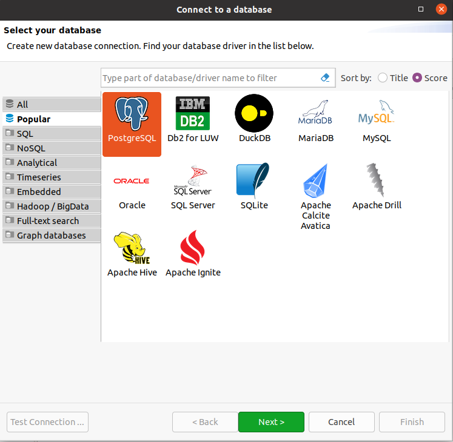
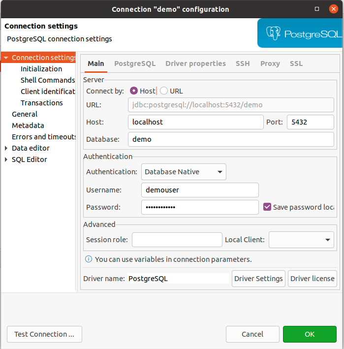
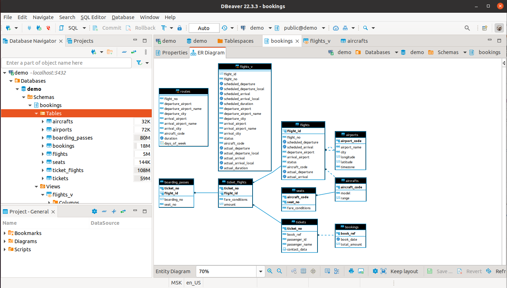

# Установка


## Докер контейнер
Самым простым способом является запуск докер-контейнера. Идем [сюда](https://hub.docker.com/_/postgres).

согласно документации нам надо запустить команду:

```
docker run --name some-postgres -e POSTGRES_PASSWORD=mysecretpassword -d postgres
```

Мы ее слегка модифицируем:
```
docker run -d --name postgress -e POSTGRES_PASSWORD=mysecretpassword -p 5432:5432 postgres
```

## Запуск postgress
Чтобы войти в контейнер можно сделать так:

```
docker exec -it postgress bash
```

Далее внутри мы можем запустить:
```
psql -U postgres
```

Также можно войти таким образом:

```
docker exec -it postgress psql -U postgres
```

## Создаем пользователя

Пользователь postgress является суперадмином с безграничными правами. 
Поэтому создадим пользователя `demouser` для работы с ним далее:

```
postgres=# create user demouser with encrypted password 'demopassword';
```

Далее создадим демо базу данных с владельцем `demouser`:

```
postgres=# create database demo owner demouser;
```
Сюда же будем загружать учебную базу данных с самолетиками.

Создадим еще игрушечную юазу данных, на которой будем практиковаться 
вставлять и удалять всякое, чтобы не портить учебную базу даных.

```
postgres=# create database games owner demouser;
```

Теперь мы можем заходить в psql таким образом:

```
docker exec -it postgress psql -U demouser -d demo
```

Можем проверить, что там у нас находится:

Команда `\l` выведет все базы данных:

```
demo=> \l
                                                List of databases
   Name    |  Owner   | Encoding |  Collate   |   Ctype    | ICU Locale | Locale Provider |   Access privileges   
-----------+----------+----------+------------+------------+------------+-----------------+-----------------------
 demo      | demouser | UTF8     | en_US.utf8 | en_US.utf8 |            | libc            | 
 games     | demouser | UTF8     | en_US.utf8 | en_US.utf8 |            | libc            | 
 postgres  | postgres | UTF8     | en_US.utf8 | en_US.utf8 |            | libc            | 
 template0 | postgres | UTF8     | en_US.utf8 | en_US.utf8 |            | libc            | =c/postgres          +
           |          |          |            |            |            |                 | postgres=CTc/postgres
 template1 | postgres | UTF8     | en_US.utf8 | en_US.utf8 |            | libc            | =c/postgres          +
           |          |          |            |            |            |                 | postgres=CTc/postgres
(5 rows)


```

команда `\du` покажет нам всех пользователей и их роли:

```
demo=> \du
                                   List of roles
 Role name |                         Attributes                         | Member of 
-----------+------------------------------------------------------------+-----------
 demouser  |                                                            | {}
 postgres  | Superuser, Create role, Create DB, Replication, Bypass RLS | {}

```

Командка `\d` покажет все таблицы:

```
demo=> \d
Did not find any relations.
```

Командка `\dn` покажет все схемы:

```
demo=> \dn
      List of schemas
  Name  |       Owner       
--------+-------------------
 public | pg_database_owner
(1 row)

```

## Установка базы данных

Идем на замечательный сайт https://postgrespro.ru/education/demo и качаем учебную базу данных.
Для начала возьмем small версию: 

```
wget https://edu.postgrespro.ru/demo-small.zip
unzip demo-small.zip
```

Скопируем в докер нашу базу данных:

```
docker cp demo_small.sql postgress:demo_small.sql
```

Теперь можно запустить команду:

```
docker exec -ti postgress psql -U demouser -d demo -f demo_small.sql
```
NOTE: Если у нас не было до этого базы demo, то эта команда скорее всего 
упадет с ошибкой, потому что у demouser нет прав на то, чтобы создавать базу данных!


Посмотрим теперь, что все хорошо:

```
docker exec -ti postgress psql -U demouser -d demo
```
Выведем все таблицы:
```
demo=> \d
Did not find any relations.
```
Как будто их нет, но схемы есть:

```
demo=> \dn
       List of schemas
   Name   |       Owner       
----------+-------------------
 bookings | demouser
 public   | pg_database_owner
(2 rows)
```

Чтобы починить отсутствие таблиц, надо ввести команду:

```
demo=> set search_path to bookings;
SET
```

Теперь у нас все красиво:

```
demo=> \d
                        List of relations
  Schema  |         Name          |       Type        |  Owner   
----------+-----------------------+-------------------+----------
 bookings | aircrafts             | table             | demouser
 bookings | airports              | table             | demouser
 bookings | boarding_passes       | table             | demouser
 bookings | bookings              | table             | demouser
 bookings | flights               | table             | demouser
 bookings | flights_flight_id_seq | sequence          | demouser
 bookings | flights_v             | view              | demouser
 bookings | routes                | materialized view | demouser
 bookings | seats                 | table             | demouser
 bookings | ticket_flights        | table             | demouser
 bookings | tickets               | table             | demouser
(11 rows)
```

Давайте проверим:

```
demo=> select * from aircrafts;
 aircraft_code |        model        | range 
---------------+---------------------+-------
 773           | Boeing 777-300      | 11100
 763           | Boeing 767-300      |  7900
 SU9           | Sukhoi SuperJet-100 |  3000
 320           | Airbus A320-200     |  5700
 321           | Airbus A321-200     |  5600
 319           | Airbus A319-100     |  6700
 733           | Boeing 737-300      |  4200
 CN1           | Cessna 208 Caravan  |  1200
 CR2           | Bombardier CRJ-200  |  2700
(9 rows)
```


## pgcli -- удобный консольный клиент

Инструкции по установке здесь: https://www.pgcli.com/install

Проще всего установить через pip:

```
pip install pgcli
```

запуск:

```pgcli -h localhost -p 5432 -U demouser -d demo```

Здесь также надо сделать 

```
set search_path to bookings;
```

И далее мы уже можем видеть красивый клиент с подсветкой синтаксиса.





## dbeaver

[Dbeaver](https://dbeaver.io/) это GUI приложение для администрирования и работы с бд.

Качается как .deb пакет. 

Чтобы подключиться к базе данных жмякаем на вилочку в верхнем левом углу:


Далее выбираем с какой базой данных будем работать:



Вводим все свои детали подключения:




Теперь можем побродить по базе данных, посмотреть схемы, данные в таблицах и так далее:

